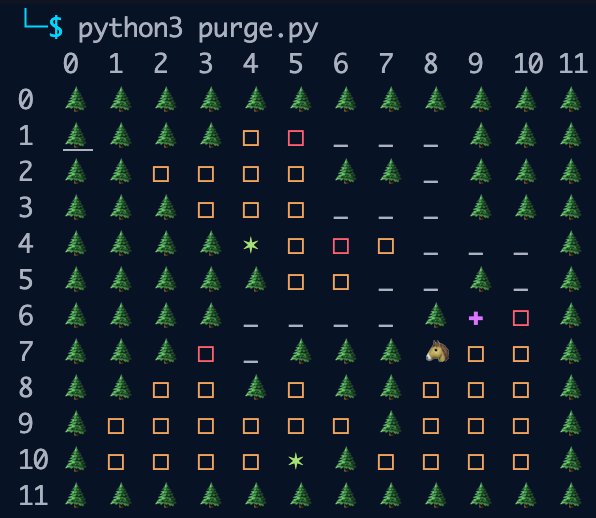
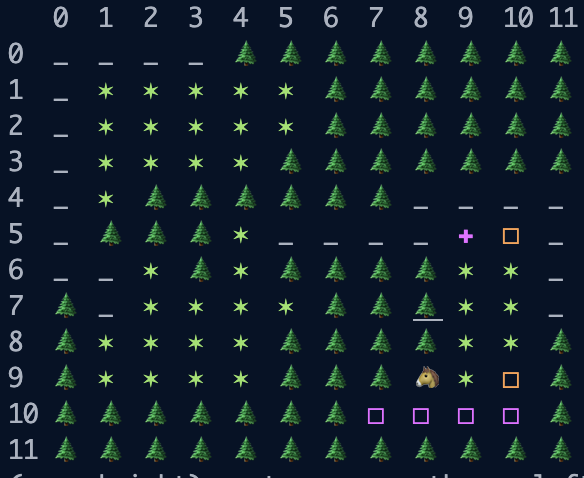
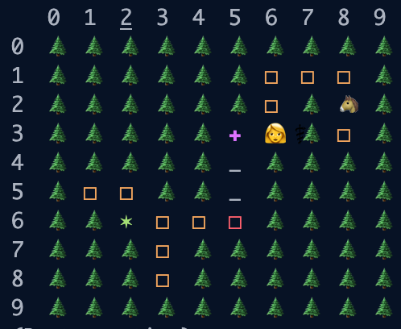
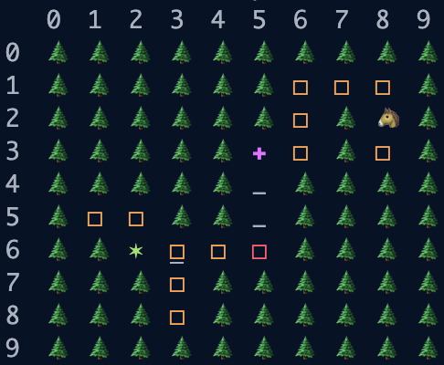
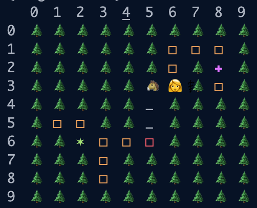

<h1>Screenshots</h1>

|Result                                          | Description                                                 |
|------------------------------------------------| ------------------------------------------------------------|
|</img>| A randomly generated map (12*12) with 3 cities in it |
|</img>| Purple squares indicates cell that cannot be infected because of Knight's action |
|</img>| Doctor places a nurse |
|</img></img>| Knight swapping position with Doctor |

<h1>Introduction</h1>

This game is inspired by both board games—Pandemic and Monopoly. In this game, players have to work with each other and try to eradicate the diseases in all cities. A player would be either doctor or knight (in current version), and different specialties will have different skills to perform during each turn. The diseases win by spreading to all cities, and occupy more than 60% of the cells in each city. The players win by curing all diseases.

<h1>Game Rules</h1>
<h2>Action</h2>
<ul>
    <li>
        <h4>Doctor</h4>
        <ul>
            <li>
                Can place a nurse in any adjacent cell
                
The nurse can cure infections in a 3x3 square centered around the position of the nurse. After performing this, the nurese will die

            </li>
            <li>Can sacrifice movement for another action in the same turn</li>
            <li>Can perform curing infections in the entire row and column according to doctor's current location</li>
        </ul>
    </li>
    <li>
        <h4>Knight</h4>
        <ul>
            <li>Can swap position with the doctor</li>
            <li>Can sacrifice movement for another action in the same turn</li>
            <li>Can perform throwing disinfectant two cells away from the knight's current position, the disinfectant can stops diseases from spreading for 2 whole rounds</li>
        </ul>
    </li>
    <li>
    <h4>Disease</h4>
    <ul>
        <li>At the end of each round, inside each city, all possible edge diseases can be picked as the root for disease spreading.</li>
        <li>Disease can spread to another city if its current position is at a gate (red square)</li>
        <li>Disease cannot grow to purple cell (cell that are disinfected)</li>
    </ul>
   </li>
</ul>

<h1>AI Knight</h1>

run `python3 GameManager.py -ai` to play with an AI.

This is a very simple AI player. The knight will try to locate an edge disease and move towards it. If the disease is in another city, the knight will locate the gate which connects to that city and then try to reach it.

Once the targeted disease is within range for knight to throw disinfectant, the knight will perform this action.

The simple AI can potentially prevent the doctor from going to another city via gate. If AI detects doctor and knight have been stuck in the same city for too many rounds, the knight will try to swap position with the doctor.

<h1>Selected Algorithms and Functionalities</h1>

- **Generating a Valid Map** 
    The worst case is `O(∞)` because we are randomly selecting the center of each city, and each of them will grow outward based on its edge cells. However, we have implemented optimizations to prevent two cities growing into each other. Once we have all the cities laid out, we will use union find to check if we indeed have generated the required city count, and if the cells from different cities touch. Even with the optimizations, if one city cannot grow to the specified block count, the map is still considered invalid.

- **A Star Search** 
    Used for connecting city to city. First, find the edge of the cities, and randomly pick two positions, one for each city. Second, do an A* search to find the shortest path. 
    **Time Complexity: (Original)**
    $$O(|V| + |E|)$$
    Originally, the time complexity is based on a graph. One vertex can connect to (V-1) vertices. However, we are working on a 2d array, and the traversing can only go to the adjacent cells. In this case, the time complexity is still `O(M * N)`, where N is the height of the board, and M is the width.

    **Space Complexity: (Original)** 
    $$O(|V| + |E|)$$
    Similar to above logic, the worst case space complexity can also be `O(M * N)`

- **Union Find** 
    Used in multiple places. For example, verifying how many random cities has been generated. We are using the top-left position as the root for each connected cell.

    In this case, because of backpropagation, the original union find will not contribute much to our program. We are `actually using dfs` to merge all the cells together (just to validate).

    **Time & Space Complexity:**
    $$O(log N)$$
    The worst case for merging is also based on the board size.

- **Data Structure for Each Cell** 
    Stack is being used here for tracking everything in a particular cell. The look-up time for each cell is `O(1)`. The space used will also be `O(1)` since we have limited classes that can be placed in the stack and once a character/disease has been placed, nothing can be placed upon it until the top-most thing has been popped.

<h1>References</h1>
<ol>
   <li><a href="https://www.zmangames.com/en/games/pandemic/">Pandemic</a></li>
   <li><a href="https://en.wikipedia.org/wiki/Monopoly_(game)">Monopoly</a></li>
   <li><a href="https://cs.stackexchange.com/questions/56176/a-graph-search-time-complexity">A Star Search complexities</a></li>
   <li><a href="https://medium.com/@yusufaksoyeng/optimized-disjoint-set-union-find-data-structure-12af9493f874">Union-Find complexities</a></li>
</ol>
